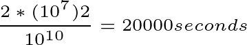
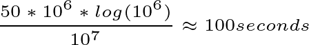

# What are algorithms?

-	Informally an algorithm is any well-defined computational procedure that take some value, or set of values, as input and produces some value, or set of values as output.

- An Algorithm is thus a **sequence of computational steps** that **transform** the **input** into the **output**.

Example: sorting a sequence of number

Input: A sequence of n numbers a1, a2, a3,...., an  
Output: A permutation (reordering) of the input sequence such that a1 <= a2 <= a3 <= .... <= an  

Which Algorithm is best for a given application depends on
  + the number of items to be sorted
  + the extent to which the items are already somewhat sorted,
  + possible restriction on the item values
  + the architecture of the computer
  + the kind of storage devices to be used (main memory, disks, or tapes)

- An algorithm is said to be **correct** if, for every input instance, it halts with the correct output. 

- An **incorrect** algorithm might not halt at all on some input instances, or it might halt with an incorrect answer.

- **incorrect algorithms** can sometimes be useful, if their error rate can be controlled.

An Algorithm can be specified 

i. in English,  
ii. as a computer program, or even  
iii. as a hardware design. 

The only requirement is that the specification must provide a precise description of the computational procedure to be followed.

## What kind of problems are solved by algorithms?  

Practical applications of algorithms are ubiquitous and include the following examples:

1. identifying all the 100,000 genes in human DNA.
2. finding good routes on which the data will travel on the internet
3. public-key cryptography and digital signatures used in E-commerce 
4. linear programming
5. shortest path in a graph
6. longest common subsequence

- Two characteristics common to many algorithmic problems:

1. they have **many candidate solutions**, majority of which **do not solve the problem**. **Finding one that does, or one that is **best**, can be challenging**.  
2. they have practical applications.  

## Data Structures

- A data structure is **a way to store and organize data** in order **to facilitate access and modifications**.  

- No single data structure works well for all purposes, so it is important to know the strengths and limitations of several of them.

## Hard Problems

There are some problems for which no efficient solution is known. A subset of these problems are known as **NP-complete**.

- It is unknown whether or not efficient algorithms exist for NP-complete problems.
- The set of NP complete problems has the remarkable property that if an efficient algorithm exists for anyone of them, then efficient algorithms exist for all of them.
- traveling-salesman problem is a well-known example of NP-complete problem.

## Algorithm as a technology

- computers may be fast but they are not infinitely fast.
- memory may be cheap but it is not free.
- **computing time is** therefore **a bounded resource**, and so is space in memory.
- these resources should be used wisely, and algorithms that are efficient in terms of time and space help us do so.

Example:
- A faster computer (computer A) running insertion sort (time complexity roughly equal to n-squared, to sort n items).
- A slower computer (computer B) running merge sort (time complexity roughly equal to n *  log(n) ).
- Both A and B sort an array of one million numbers. 
- Computer A executes one billion instructions per second.
- Computer B executes ten million instructions per second. (A is 100 times faster than B in raw computing power)
- A skilled programmer codes insertion sort in machine language for computer A.
- Merge sort is programmed by an average programmer in high level language with an inefficient compiler.
- To sort one million numbers computer A takes:

- While computer B takes: 

- By using an algorithm whose running time grows more slowly, even with a poor compiler, computer B runs 20 times faster than computer A.

- The advantage of merge sort is even more pronounced when we sort ten million numbers where insertion sort takes approximately 2.3 days, merge sort takes under 20 minutes. In general as the problem size increases, so does the relative advantage of merge sort.

- This example shows that algorithm like computer hardware are a technology. 
